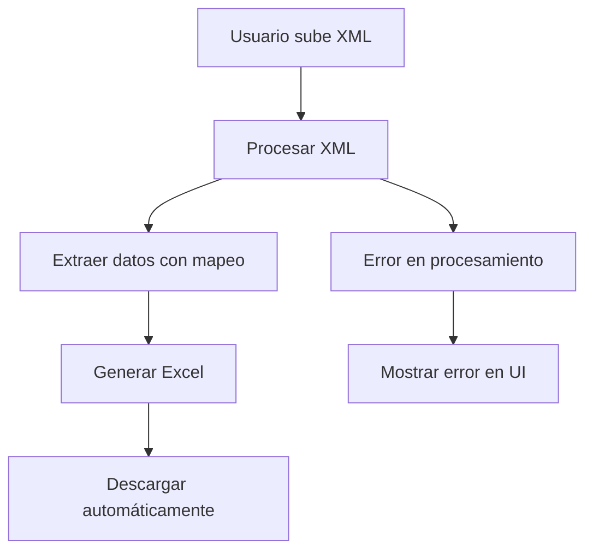

# Descarga de Excel desde XML

Esta funcionalidad permite procesar archivos XML de facturas electrónicas italianas y descargar automáticamente un archivo Excel con los datos extraídos.

## Funcionalidad

### Procesamiento XML → Excel
1. **Subida de XML**: El usuario sube un archivo XML a través de la interfaz
2. **Procesamiento**: El sistema extrae datos usando el archivo de mapeo Excel
3. **Generación de Excel**: Se crea un nuevo archivo Excel con los datos extraídos
4. **Descarga automática**: El archivo Excel se descarga automáticamente al navegador

### Estructura del Excel Generado
- **Columna 1**: Nombre del archivo XML original
- **Columnas 2+**: Datos extraídos según el mapeo de IDs
- **Headers**: Nombres de columnas con IDs correspondientes
- **Formato**: Excel con estilos (headers en negrita, fondo gris)

## Archivos Modificados

### 1. **Backend** (`src/app/api/accounting-xml/route.ts`)
- ✅ Eliminada integración con N8N
- ✅ Agregada generación de archivo Excel
- ✅ Configurada respuesta para descarga
- ✅ Headers correctos para archivo Excel

### 2. **Procesador XML** (`src/lib/xml-to-excel-processor.ts`)
- ✅ `generateExcelFromXmlData()`: Genera Excel desde múltiples XMLs
- ✅ `generateSingleXmlExcel()`: Genera Excel desde un XML individual
- ✅ Estilos y formato del Excel
- ✅ Manejo de errores en el Excel

### 3. **Frontend** (`src/app/home/accounting-xml/page.tsx`)
- ✅ Detección de respuesta Excel vs JSON
- ✅ Descarga automática de archivos
- ✅ Manejo de respuestas binarias
- ✅ Nombres de archivo automáticos

## Flujo de Trabajo



## Características del Excel Generado

### Estructura
```
| Filename | Column 1 (ID: 1.1.1.1) | Column 2 (ID: 1.1.1.2) | ... |
|----------|-------------------------|-------------------------|-----|
| invoice.xml | IT | 01234567890 | ... |
```

### Estilos
- **Headers**: Negrita, fondo gris claro
- **Datos**: Formato normal
- **Errores**: Texto rojo
- **Columnas**: Auto-ajustadas

### Nombres de Archivo
- **Entrada**: `invoice.xml`
- **Salida**: `invoice_extracted_data.xlsx`

## Manejo de Errores

### Errores de Procesamiento
- Se muestran en la UI como antes
- No se genera archivo Excel
- Mensaje de error claro

### Errores en Excel
- Se incluyen como filas de error
- Texto en rojo
- Información del error

## Configuración Requerida

### Archivos Necesarios
1. **`hierarchical_mapping_fixed.xlsx`** en `src/app/data/`
2. **Archivos XML** para procesar

### Dependencias
```bash
npm install xml2js @types/xml2js exceljs
```

## Uso

### Para el Usuario
1. Ir a `/home/accounting-xml`
2. Subir archivo XML en el panel "Upload XML"
3. El archivo Excel se descarga automáticamente
4. Revisar los datos extraídos en el Excel

### Para Desarrolladores
```typescript
// Procesar XML individual
const result = await processXmlToExcel(xmlContent, mappingExcel);

// Generar Excel
const excelBuffer = await generateSingleXmlExcel(filename, result, mappingExcel);

// Descargar
const blob = new Blob([excelBuffer], { 
  type: 'application/vnd.openxmlformats-officedocument.spreadsheetml.sheet' 
});
```

## Ventajas

1. **Sin dependencias externas**: No requiere N8N
2. **Descarga inmediata**: Resultado instantáneo
3. **Formato estándar**: Excel compatible con todas las herramientas
4. **Datos estructurados**: Fácil de analizar y procesar
5. **Manejo de errores**: Información clara de problemas

## Limitaciones

1. **Un archivo a la vez**: No procesamiento por lotes en la UI
2. **Tamaño de archivo**: Limitado por memoria del navegador
3. **Formato fijo**: Estructura determinada por el mapeo Excel

## Próximas Mejoras

- [ ] Procesamiento por lotes en la UI
- [ ] Opciones de formato de salida
- [ ] Validación de datos extraídos
- [ ] Preview de datos antes de descarga
